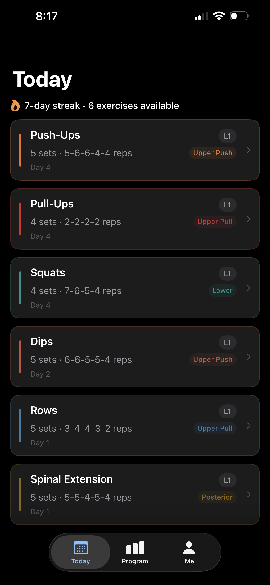
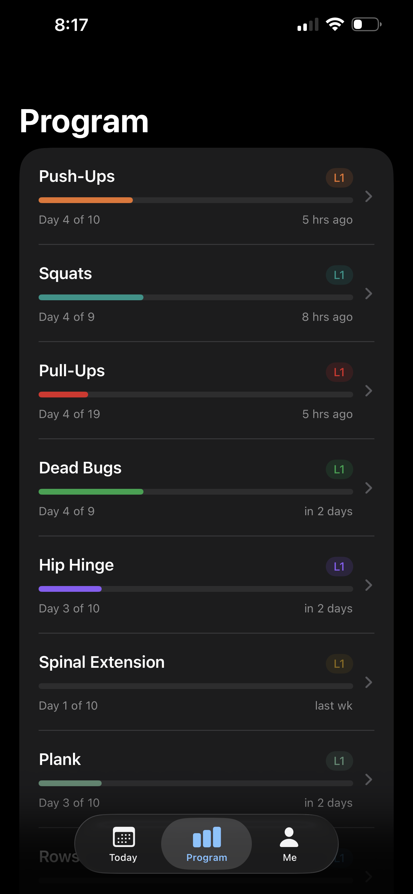
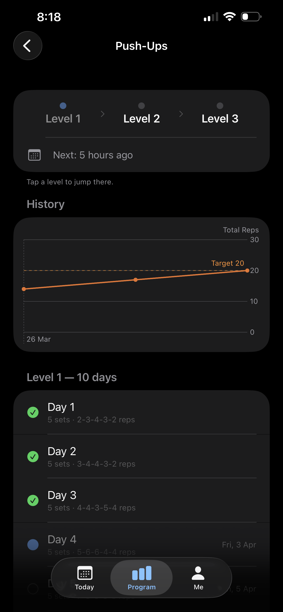
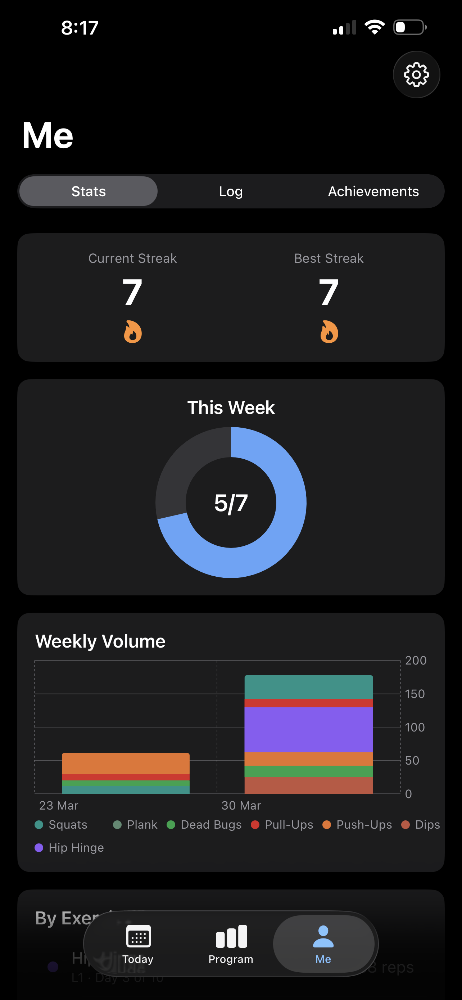
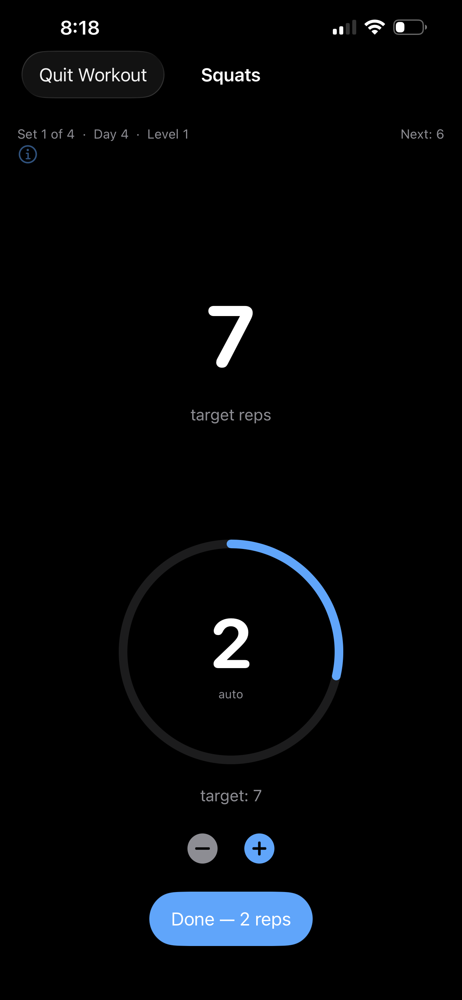

# Daily Ascent — Bodyweight Training App

[](https://apps.apple.com/us/app/daily-ascent/id6760611343)

iOS + watchOS app that guides users through structured bodyweight training programs. Nine exercises, three progressive levels each, with an optional "Prepare" beginner tier on the harder upper-body exercises. Users enrol in exercises, follow a prescribed set/rep scheme per day, and advance through levels by passing a max-rep test.

Built as a personal project to explore the full breadth of the Apple SDK — from strict Swift 6 concurrency to Core Motion sensor pipelines to a custom scheduling engine.

<p align="center">
  
  
  
  
  
</p>

---

## Tech Stack

| | |
|---|---|
| **Platform** | iOS 18.0 + watchOS 10.6 |
| **Language** | Swift 6.2, strict concurrency, main-actor isolation |
| **UI** | SwiftUI only |
| **Data** | SwiftData (CloudKit-ready schema) |
| **Concurrency** | Swift concurrency only — no GCD, no Combine |
| **Third-party deps** | None |
| **Xcode** | 16.0+ |

---

## Exercises

| Exercise | Muscle Group | Levels | Test Targets |
|---|---|---|---|
| Push-Ups | Upper (push) | 3 + Prepare | 20 → 50 → 100 |
| Squats | Lower | 3 | 20 → 100 → 150 |
| Pull-Ups | Upper (pull) | 3 + Prepare | 10 → 20 → 30 |
| Dips | Upper (push) | 3 + Prepare | 20 → 15 → 10 |
| Rows | Upper (pull) | 3 | 15 → 20 → 12 |
| Hip Hinge | Lower (posterior) | 3 | 30 → 20 → 20 |
| Spinal Extension | Lower (posterior) | 3 | 20 → 20 → 20 |
| Plank | Core (stability) | 3 | 60s → 90s → 120s |
| Dead Bugs | Core (stability) | 3 | 20 → 50 → 80 |

The "Prepare" tier on Pull-Ups, Push-Ups, and Dips offers an easier variation (negatives, incline, assisted) with a mid-program checkpoint test — a gentler on-ramp for beginners where the Level 1 entry point is too demanding.

---

## Architecture

### Shared Package

All business logic and SwiftData models live in a Swift package (`Shared/`) imported by both app targets. The package has no main-actor isolation — both app targets do, so all view and service code is implicitly `@MainActor` without annotation.

### Scheduling Engine

The core of the app is a pure, stateless scheduling engine in `Shared/Sources/InchShared/Engine/`. It runs on value types with no framework dependencies, making it fully testable in isolation.

- **`SchedulingEngine`** — computes next session dates from rest-day patterns per exercise
- **`ConflictDetector`** — prevents scheduling same-muscle-group exercises on consecutive days
- **`ConflictResolver`** — resolves conflicts by pushing affected sessions forward
- **`AdaptationEngine`** — adjusts prescription based on completion ratios: repeat day, early test eligibility, or prescription reduction
- **`DailyLoadAdvisor`** — projects upcoming load across all enrolled exercises
- **`StreakCalculator`** — calculates streaks with partial completion and gap handling
- **`AchievementChecker`** — evaluates achievement conditions post-workout; caller handles persistence
- **`RepCounter`** — exercise-specific thresholds and smoothing config for motion-based rep detection

### Sensor Pipeline

Core Motion captures accelerometer and gyroscope data during every set on both iPhone and Apple Watch. Sensor files are binary, transferred from watch to phone via WatchConnectivity file transfer, then batch-uploaded to Supabase via `BGProcessingTask`. The dataset is intended for future ML-based automatic rep counting.

### Rep Counting

Three modes, selectable per exercise in Settings:

- **Real-time** — tap the screen once per rep as you go; sensor data is captured in parallel for future ML-based auto-counting
- **Metronome** — the app paces you with audio and haptic beats and counts reps automatically; configurable BPM and beat pattern per exercise
- **Post-set** — rest timer runs during the set, then confirm how many reps you completed

Time-based exercises (e.g. Plank) use a timed hold mode automatically: a countdown timer with no rep entry.

### State Management

`@Observable` view models throughout — no `@StateObject`, `@ObservedObject`, `@EnvironmentObject`, or `@Published`.

### Navigation

`NavigationStack` with `navigationDestination(for:)` everywhere. No `NavigationLink(destination:)`, no `NavigationView`.

---

## Apple Frameworks Used

| Framework | Purpose |
|---|---|
| SwiftData | Persistent storage, CloudKit-ready schema |
| WatchConnectivity | Schedule push, workout sync, sensor file transfer |
| Core Motion | Accelerometer/gyroscope capture for rep detection |
| HealthKit | Workout session logging |
| UserNotifications | Scheduled workout reminders |
| BackgroundTasks | `BGProcessingTask` for sensor data upload |
| MetricKit | Crash and hang diagnostics |
| Charts | Weekly volume visualization in History |

---

## Repo Structure

```
inch-project/
├── inch/                              # Xcode project
│   ├── inch/                          # iOS app target
│   │   ├── Features/
│   │   │   ├── Onboarding/            # Enrolment, placement test, data consent
│   │   │   ├── Today/                 # Daily dashboard + view model
│   │   │   ├── Workout/               # Session, counting modes, rest timer, achievements
│   │   │   ├── Program/               # Progress, exercise detail, upcoming schedule
│   │   │   ├── History/               # Completed workout log, stats, trophy shelf
│   │   │   ├── Settings/              # Rest timers, counting mode, notifications, privacy
│   │   │   └── Debug/                 # Internal debug panel (non-shipping)
│   │   ├── Components/                # Shared UI components
│   │   ├── Extensions/                # Swift/SwiftUI extensions
│   │   ├── Navigation/                # NavigationStack destinations
│   │   └── Services/
│   │       ├── WatchConnectivityService.swift
│   │       ├── MotionRecordingService.swift
│   │       ├── HealthKitService.swift
│   │       ├── DataUploadService.swift    # BGProcessingTask + Supabase
│   │       ├── NotificationService.swift
│   │       ├── AnalyticsService.swift
│   │       └── MetricKitService.swift
│   └── inchwatch Watch App/           # watchOS app target
│       ├── Features/                  # Watch Today, Workout, History, Settings
│       ├── Models/                    # Watch-local state (history store, settings)
│       └── Services/
│           ├── WatchConnectivityService.swift
│           ├── WatchMotionRecordingService.swift
│           └── WatchHealthService.swift
├── Shared/                            # Swift package shared by both targets
│   └── Sources/InchShared/
│       ├── Models/                    # SwiftData @Model classes + enums
│       ├── Engine/                    # Pure business logic (no SwiftData dependency)
│       │   ├── SchedulingEngine.swift
│       │   ├── ConflictDetector.swift
│       │   ├── ConflictResolver.swift
│       │   ├── AdaptationEngine.swift
│       │   ├── StreakCalculator.swift
│       │   ├── AchievementChecker.swift
│       │   ├── DailyLoadAdvisor.swift
│       │   ├── RepCounter.swift
│       │   └── ExerciseDataLoader.swift
│       ├── Transfer/                  # WatchConnectivity DTOs
│       └── Utilities/
└── files/                             # Spec documents (read-only reference)
```

---

## Key Models

| Model | Purpose |
|---|---|
| `ExerciseDefinition` | Static exercise data (name, muscle group, levels) |
| `LevelDefinition` | Level config (test target, sets, rest pattern) |
| `DayPrescription` | Per-day rep targets for one level |
| `ExerciseEnrolment` | User's enrolment state: current level, day, next scheduled date |
| `CompletedSet` | Record of one completed set (reps, duration, recording reference) |
| `SensorRecording` | Metadata for a captured motion file |
| `UserSettings` | App-wide preferences (counting mode, rest timers, consent, notifications) |
| `StreakState` | Current streak count and last-updated date |
| `Achievement` | Unlocked achievement record (streak, level, rep milestones) |
| `UserEntitlement` | In-app purchase / subscription record |

---

## Build & Run

```bash
open inch/inch.xcodeproj
# Simulator: iPhone 16 Pro + Apple Watch Series 10
```

Signing is automatic. Before building, create `inch/inch/Secrets.plist` (gitignored):

```xml
<?xml version="1.0" encoding="UTF-8"?>
<!DOCTYPE plist PUBLIC "-//Apple//DTD PLIST 1.0//EN" "http://www.apple.com/DTDs/PropertyList-1.0.dtd">
<plist version="1.0">
<dict>
    <key>SupabaseURL</key>
    <string>https://your-project.supabase.co</string>
    <key>SupabaseAnonKey</key>
    <string>your-publishable-key</string>
</dict>
</plist>
```

Without this file the app builds and runs normally — sensor upload is simply skipped. Upload only activates when the user has granted data consent in onboarding.

---

Previously developed under the name *Inch*.
